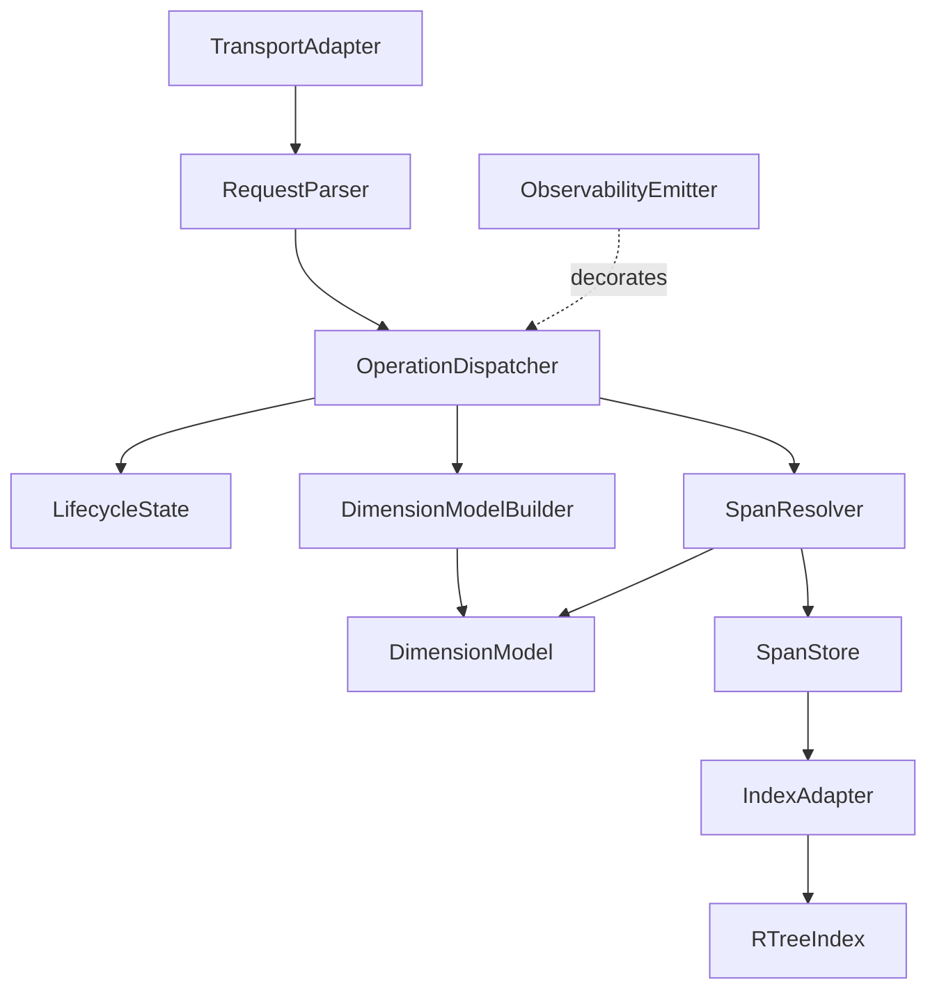

# DT-4: Component Structure

| Document attribute | Value |
|---|---|
| Status | ECP-1 revised design |
| Governing input | [Interface Contract](../interface-contract.md), [Operational Concept](../operational-concept.md), [Observability Contract](../observability-contract.md) |
| Depends on | [DT-1](dt-1-architectural-context.md), [DT-2](dt-2-dimension-to-axis-mapping.md), [DT-3](dt-3-empty-span-representation.md) |

## 1. Decision

Retain the hexagonal core and its transport, index, and observability adapters, but reduce
the core to the spans-only model. Remove the payload-specific validator and every
semantic-error owner. `SpanStore` owns the two retained stored-state outcomes.

## 2. Component diagram



Dependency direction remains inward. The domain uses an index port; geometry does not
leak into dispatch or storage behavior.

## 3. Responsibilities and interfaces

| Component | Responsibility | Interface | Declared code |
|---|---|---|---|
| `TransportAdapter` | Hand raw JSON to the core and serialize its response. | `handle(raw) -> response` | — |
| `RequestParser` | Enforce only the structural JSON boundary and narrow to one operation payload. | `parse(raw) -> Request` | `MALFORMED_REQUEST` |
| `OperationDispatcher` | Enforce serial execution and lifecycle gating; route six operations. | `dispatch(Request) -> Result` | `INVALID_STATE` |
| `LifecycleState` | Hold state and legal operation gates. | `current`, `canAccept`, transitions | — |
| `DimensionModelBuilder` | Build axis order and nested intervals, assuming a coherent definition. | `build(definition) -> DimensionModel` | — |
| `DimensionModel` | Hold immutable axes/intervals and produce boxes and points. | `spanToBox`, `planLineToPoint`, counts | — |
| `SpanResolver` | Canonicalize dimension maps and derive geometry without semantic checks. | `resolveSpan`, `resolvePlanLine` | — |
| `SpanStore` | Own stored span identity, replacement, exact lookup, deletion, matching, and count. | `create`, `update`, `delete`, `exact`, `match`, `count` | `DUPLICATE_SPAN`, `NOT_FOUND` |
| `IndexAdapter` | Express the spatial index in spans and plan lines. | `insert`, `remove`, `findExact`, `searchMatching`, `size` | — |
| `RTreeIndex` | Generic n-dimensional geometry over `CanonicalSpan` payloads. | `insert`, `remove`, `search` | — |
| `ObservabilityEmitter` | Decorate dispatch and emit closed-field completion records. | `dispatch(raw)` | — |

Unexpected exceptions propagate. No component owns a general internal-error response.

## 4. Declared-code ownership

| Code | Single owner | Reason |
|---|---|---|
| `MALFORMED_REQUEST` | `RequestParser` | A structurally unusable envelope cannot select a handler. |
| `INVALID_STATE` | `OperationDispatcher` | Acceptance depends on lifecycle state. |
| `DUPLICATE_SPAN` | `SpanStore` | Requires knowledge of canonical identities already stored. |
| `NOT_FOUND` | `SpanStore` | Requires knowledge of exact stored identity. |

The state codes are returned deliberately rather than thrown and translated. The former
semantic and index error ownership is retired by ECP-1.

## 5. Pipeline order

```text
TransportAdapter
  -> RequestParser         structural envelope only
  -> OperationDispatcher   lifecycle gate
  -> DimensionModelBuilder                    [initialize]
     | SpanResolver -> SpanStore               [all span operations]
     | SpanResolver -> SpanStore.match         [queryPlanLine]
  -> IndexAdapter -> RTreeIndex
```

The state gate precedes domain work. After the gate, inputs are assumed semantically
correct. Create/update/delete/exact outcomes are determined inside `SpanStore` before any
mutation that could invalidate their declared no-change behavior.

For `updateSpan`, store precedence is:

1. find source or return `NOT_FOUND`;
2. find replacement and return `DUPLICATE_SPAN` when occupied by a different entry;
3. remove source and insert replacement;
4. return replacement with unchanged count.

## 6. DT-1 patterns after ECP-1

| Pattern | Placement |
|---|---|
| Hexagonal | Transport, index, and observability are adapters around the core. |
| Adapter | `IndexAdapter` converts spans/plan lines to geometry operations. |
| Strategy | Nested-interval labelling remains behind `DimensionModelBuilder`. |
| Value object | Immutable `CanonicalSpan` is both stored payload and identity. |
| State | `LifecycleState` centralizes operation gating. |
| Command | Parsed requests give dispatch and observability one operation vocabulary. |
| Decorator | `ObservabilityEmitter` wraps dispatch. |
| Closed-field builder | Log records accept only bounded primitive fields. |

The former validation chain is removed rather than represented as a pattern.

## 7. Constraint satisfaction

**Serial processing.** Every operation enters through the dispatcher.

**Successful reinitialization.** A candidate model and fresh empty index replace live
references together for valid input. ECP-1 makes no preservation promise for an invalid
model or unexpected failure.

**Declared failure integrity.** Only `SpanStore` mutates span state. Its duplicate,
absence, and update-collision outcomes are resolved before mutation.

**Privacy.** The emitter accepts operation/state/count primitives, never span or plan-line
maps. Its sink is no longer exception-isolated under optimistic execution.

**Zero axes.** Valid state and duplicate detection keep splitting unreachable. The former
defensive split assertion is removed per revised DT-3.

## 8. Decisions recorded

| ID | ECP-1 decision | Status |
|---|---|---|
| DEC-26 | Hexagonal core with three adapters. | Retained with a smaller core. |
| DEC-27 | Each declared code has one owner. | Revised from nine codes to four. |
| DEC-28 | Parser enforces structural envelope shape only. | Retained; payload-specific commentary removed. |
| DEC-29 | State gate precedes domain work. | Retained. |
| DEC-30 | Dispatcher is the single operation entry point. | Retained. |
| DEC-31 | Index adapter is expressed in spans and plan lines. | Retained; payload narrows to `CanonicalSpan`. |
| DEC-32 | Emitter is the sole JSON Lines writer. | Retained; sink-failure isolation removed. |
| DEC-33 | Build candidate model before live swap. | Retained for valid inputs. |
| DEC-66 | `SpanStore` implements update as source removal plus replacement creation after both state checks. | Added by ECP-1. |

## 9. Superseded components and paths

ECP-1 removes the payload-specific validator, semantic dimension/value error paths,
dimension-definition rejection path, index-exception mapping, and the prior store wrapper
type. Historical prototypes remain Phase 1 evidence and are not the current component
contract.

## 10. Limitations

This record specifies boundaries, not implementation success. E1 verifies the spans-only
structure; E2 verifies that defensive checks and exception translation are actually
absent while the four declared state outcomes still behave as specified.
