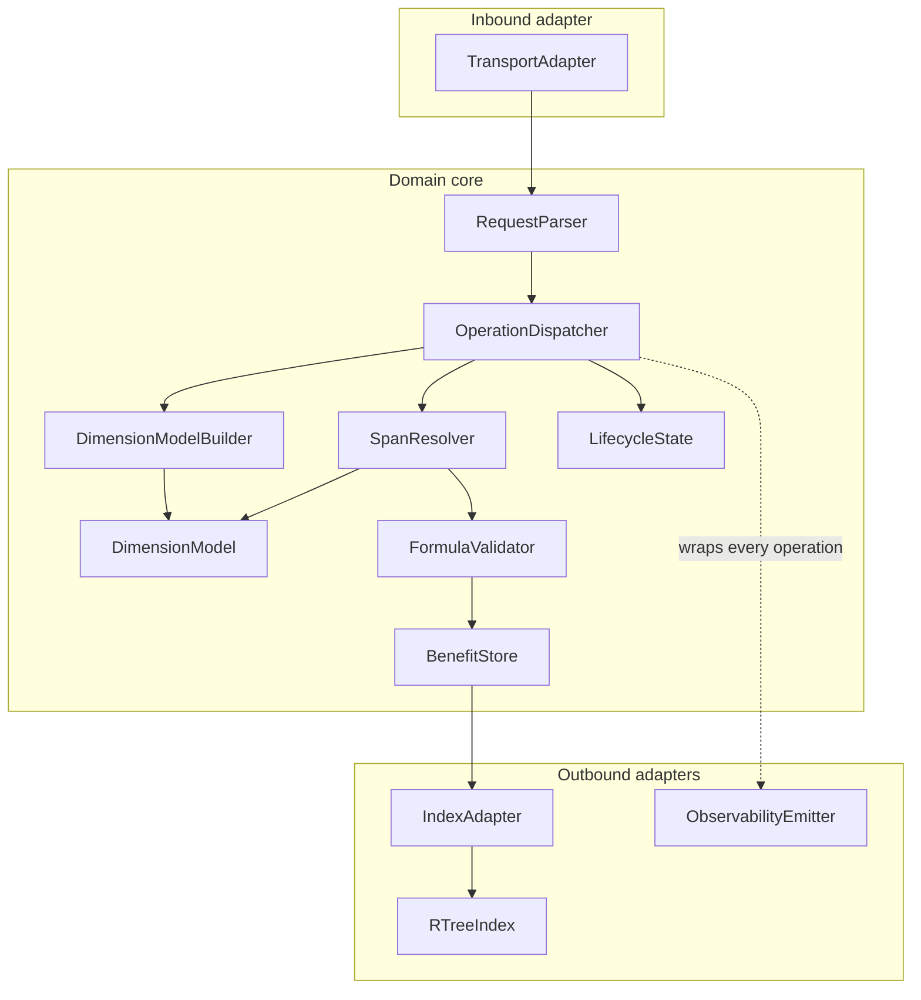

# DT-4: Component Structure

| Document attribute | Value |
|---|---|
| Status | Draft; awaiting technical-lead approval |
| Design task | DT-4 of the [Preliminary Design Execution Plan](../preliminary-design-plan.md) |
| Governing input | [Interface Contract](../interface-contract.md) 6, 6.1, 7; [Operational Concept](../operational-concept.md) 8, 10, 14; [Observability Contract](../observability-contract.md) |
| Depends on | [DT-1](dt-1-architectural-context.md), [DT-2](dt-2-dimension-to-axis-mapping.md), [DT-3](dt-3-empty-span-representation.md) |
| Prototypes | [error ownership](prototypes/dt-4-error-ownership.mjs), [pipeline order](prototypes/dt-4-pipeline-order.mjs) |

## 1. Decision

Eleven components arranged as a hexagonal core with three adapters, following DT-1's DEC-5. Each of the nine error codes has exactly one owning component, and the components are ordered so that the contract's precedence rules fall out of the ordering rather than being enforced by special cases.

## 2. Component diagram



Dependency direction is inward. `TransportAdapter`, `IndexAdapter`, and `ObservabilityEmitter` depend on the core; the core depends on none of them. The core references the index and the emitter through interfaces it declares itself, satisfying DT-1's dependency-inversion principle.

## 3. Responsibilities and interfaces

| Component | Responsibility | Interface it exposes | Owns error code |
|---|---|---|---|
| `TransportAdapter` | Receives a message over whatever transport DT-1 selected and hands the raw JSON to the core. Maps the response envelope back. Holds no business logic. | `handle(rawJson) -> responseEnvelope` | — |
| `RequestParser` | Validates envelope structure against the JSON Schema. Rejects undeclared fields, wrong types, bad `contractVersion`, unknown `operation`, invalid `requestId`, duplicate members. Deliberately does **not** judge `formula` or `format`. | `parse(raw) -> Request \| Error` | `MALFORMED_REQUEST` |
| `OperationDispatcher` | Enforces serial processing and the IC 6.1 state gate. Routes an accepted request to its handler. The single entry point for every operation. | `dispatch(Request) -> Result` | `INVALID_STATE` |
| `LifecycleState` | Holds the current state and the legal transitions. Consulted by the dispatcher, mutated only by initialization. | `current()`, `canAccept(op)`, `transition(to)` | — |
| `DimensionModelBuilder` | Validates a dimension definition and builds a candidate model, including DT-2's interval labelling. Rejects bad format, duplicate ids or keys, dangling parents, cycles. | `build(definition) -> DimensionModel \| Error` | `INVALID_DIMENSION_DEFINITION` |
| `DimensionModel` | Immutable. Holds dimensions, axis order, and each value's `[enter, leave]` interval. Answers value lookups and produces boxes and query points. | `axisCount()`, `intervalOf(dim, key)`, `spanToBox(span)`, `planLineToPoint(line)` | — |
| `SpanResolver` | Resolves a span or plan line against the loaded model, rejecting unknown dimensions and values. Produces the canonical span key and the geometry. | `resolveSpan(span) -> CanonicalSpan \| Error`, `resolvePlanLine(line) -> QueryPoint \| Error` | `UNKNOWN_DIMENSION`, `UNKNOWN_DIMENSION_VALUE` |
| `FormulaValidator` | Checks that `formula` is a non-null object within the 65,536-byte serialized limit. Never inspects contents. | `validate(formula) -> Formula \| Error` | `INVALID_FORMULA` |
| `BenefitStore` | Owns benefit identity and lifecycle. Detects duplicates and absences by canonical span key. Delegates geometry to the index. | `create`, `update`, `delete`, `exact`, `match`, `count()` | `DUPLICATE_SPAN`, `NOT_FOUND` |
| `IndexAdapter` | Domain-facing port over the spatial index, expressed in spans and plan lines rather than boxes and points. Isolates the core from the index implementation. | `insert`, `remove`, `search(point)`, `size()` | `INDEX_FAILURE` |
| `RTreeIndex` | The n-dimensional R*-tree from DT-2a. Pure geometry; knows nothing of spans, formulas, or error codes. | `insert(box, ref)`, `remove(ref)`, `search(point)` | — |
| `ObservabilityEmitter` | Builds and writes one JSON Lines record per completed operation through a closed-field builder. | `record(outcome)` | — |

`DimensionModel` and `RTreeIndex` appear in the diagram but are data and algorithm rather than decision points; neither can produce an error code.

## 4. Error-code ownership

The DT-4 exit criterion requires every one of the nine codes to have exactly one owning component. Verified mechanically:

```
codes in contract : 9
codes assigned    : 9
unassigned        : none
assigned-but-fake : none

owning components : 7
  RequestParser            MALFORMED_REQUEST
  DimensionModelBuilder    INVALID_DIMENSION_DEFINITION
  OperationDispatcher      INVALID_STATE
  SpanResolver             UNKNOWN_DIMENSION, UNKNOWN_DIMENSION_VALUE
  FormulaValidator         INVALID_FORMULA
  BenefitStore             DUPLICATE_SPAN, NOT_FOUND
  IndexAdapter             INDEX_FAILURE

exit criterion: MET - all 9 codes, exactly one owner each
```

Single ownership is what makes the codes testable in isolation. If two components could emit `NOT_FOUND`, a test asserting it would not identify which path produced it.

## 5. Pipeline order

Components are traversed in a fixed order, and that order is what produces the contract's required precedence. IC 7 states that a condition with a dedicated semantic code must not be pre-empted by structural rejection, which constrains where two checks may sit.

```
TransportAdapter
  -> RequestParser        envelope structure only
  -> OperationDispatcher  state gate (IC 6.1)
  -> DimensionModelBuilder            [initialize]
     | SpanResolver -> FormulaValidator  [benefit operations]
  -> BenefitStore         identity outcomes
  -> IndexAdapter         index failures
```

Two placements are deliberate and would be easy to get wrong.

**`RequestParser` does not judge `formula` or `format`.** DT-2a's schema change left both structurally unconstrained precisely so that `INVALID_FORMULA` and `INVALID_DIMENSION_DEFINITION` reach their semantic owners. If the parser rejected them, the contract's own invalid-example table would be violated. This is the failure the WP-7 review caught as ISSUE-03, now prevented structurally.

**The state gate precedes all payload validation.** A `createBenefit` sent before initialization returns `INVALID_STATE`, not a payload error, even when the payload is also wrong. Semantic dimension validation cannot run before a model exists, so any other order would be incoherent.

The ordering was verified against seventeen cases covering every code, the full IC 6.1 state matrix including the retry-from-`failed` path, and two precedence cases:

```
17/17 pipeline orderings produce the contract's code
```

## 6. Applying the DT-1 patterns

DT-1 catalogued patterns with the constraint each serves. Their placement here:

| Pattern | Where |
|---|---|
| Hexagonal | `TransportAdapter`, `IndexAdapter`, `ObservabilityEmitter` as adapters; everything else core. |
| Adapter | `IndexAdapter` over `RTreeIndex`, expressed in domain terms. |
| Strategy | The interval-labelling scheme behind `DimensionModelBuilder`. DT-2 settled on nested intervals; the seam remains. |
| Value object | `CanonicalSpan`, immutable with structural equality, produced only by `SpanResolver`. |
| State | `LifecycleState` holding IC 6.1 as a transition table rather than scattered conditionals. |
| Chain of responsibility | The section 5 pipeline. |
| Command | Each request reified for dispatch, giving the emitter one place to time every operation. |
| Decorator | `ObservabilityEmitter` wrapping dispatch rather than being called from each handler. |
| Builder with fixed fields | Log-record construction inside the emitter. |

## 7. How the structure satisfies key constraints

**Serial processing (OC 16.1.14).** Every operation enters through `OperationDispatcher`. Combined with DT-1's single-threaded runtime, no two operations interleave. The dispatcher is the only place this must hold.

**Atomic reinitialization (OC 8.3).** `DimensionModelBuilder` produces a *candidate* model without touching the live one. Only on success does the dispatcher swap the model reference and hand `BenefitStore` a fresh index. On failure the candidate is discarded and the previous model and benefits remain. Because both are immutable references, the swap is a single assignment with no intermediate observable state.

**Failed operations change nothing (OC 14.3).** Every validating component returns a result rather than mutating. Only `BenefitStore` mutates, and only after all validation has passed.

**Privacy (Obs 7).** `ObservabilityEmitter` is the sole writer to the log stream, and its builder accepts only the closed set of primitive fields. No component passes a span, formula, or dimension value to it, and the builder's signature makes doing so impossible rather than merely discouraged.

**Zero-axis assertion (DT-3, DEC-17).** Placed in `RTreeIndex`'s split routine, since that is the only unreachable path. `IndexAdapter` does not need to know about it.

## 8. Decisions recorded

| ID | Decision | Rationale |
|---|---|---|
| DEC-26 | Eleven components: a hexagonal core with three adapters | DT-1 DEC-5; isolates transport and index from the domain. |
| DEC-27 | Each of the nine error codes has exactly one owning component | Makes each code testable in isolation. |
| DEC-28 | `RequestParser` validates envelope structure only, never `formula` or `format` | IC 7 precedence; prevents the ISSUE-03 regression structurally. |
| DEC-29 | The state gate precedes all payload validation | IC 6.1; semantic validation requires a loaded model. |
| DEC-30 | `OperationDispatcher` is the single entry point for every operation | Concentrates serial processing and state gating in one place. |
| DEC-31 | `IndexAdapter` is expressed in spans and plan lines, not boxes and points | Keeps geometry out of the domain core and preserves the DT-2a substitution seam. |
| DEC-32 | `ObservabilityEmitter` is the sole writer to the log stream | Single enforcement point for Obs 7. |
| DEC-33 | The candidate dimension model is built before any live state changes | Makes atomic reinitialization a single reference swap. |

## 9. Open items

| Item | Owner task |
|---|---|
| Whether an error envelope carries a non-200 status | Deferred to implementation; `error.code` remains authoritative per DT-1 DEC-4 |
| Transition table contents and enforcement detail | DT-5 |
| Validation pipeline internals and the schema-driven parser | DT-6 |
| Emitter timing, `sequence` generation, and failure isolation | DT-8 |
| Component-level test boundaries | DT-9 |

## 10. Limitations

The two prototypes verify the *design's* ownership and ordering claims, not an implementation. They model each component as a decision point and confirm that the arrangement produces the contract's codes. Whether the built components behave this way is DT-9's and the implementation's responsibility.

The seventeen ordering cases cover every code and the full state matrix, but they are hand-constructed. Unlike DT-2's differential test there is no independent oracle here, because the contract *is* the oracle. DT-6 should re-run the twelve invalid messages from the readiness review against the real pipeline.
