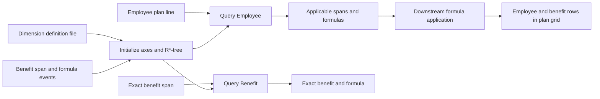
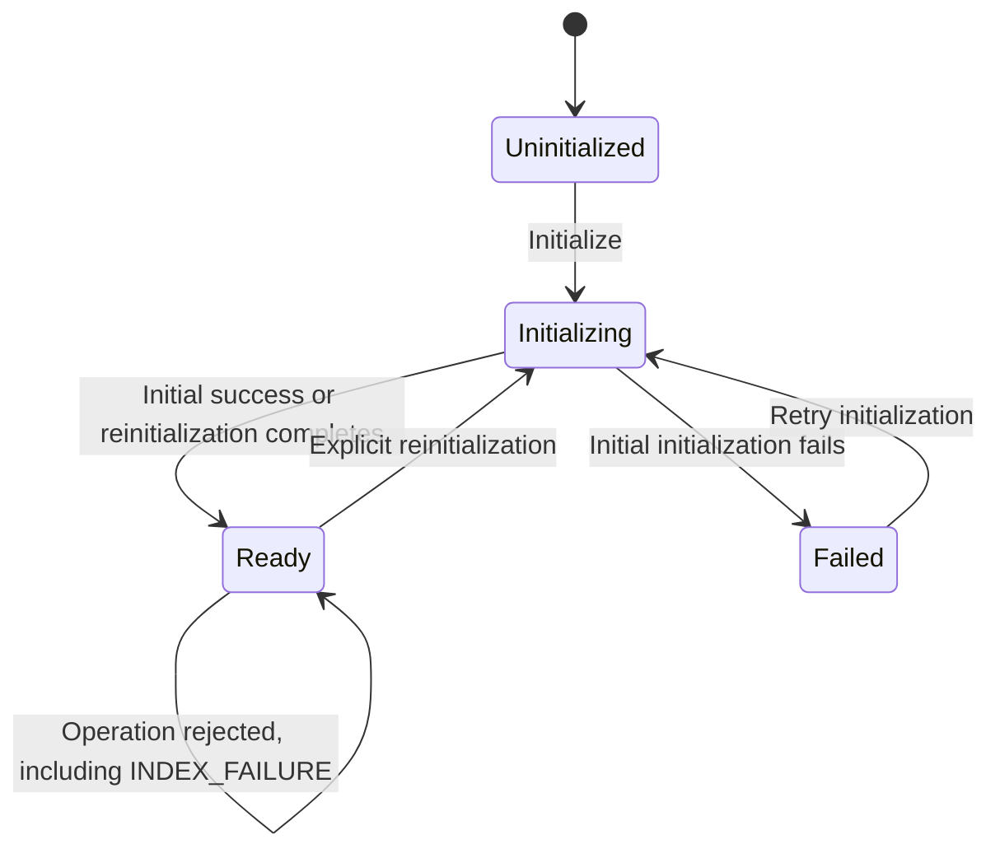

# Plan Line to Span Utility

## Operational Concept

| Document attribute | Value |
|---|---|
| Status | Draft |
| Purpose | Define how the Plan Line to Span utility is expected to operate |
| Primary use case | Associate employee benefit definitions with employee plan lines |
| Authority | Sole governing statement of demo behavior; the approved implementation baseline |
| Interface contract | [Plan Line to Span Interface Contract](interface-contract.md) |
| Observability contract | [Plan Line to Span Observability Contract](observability-contract.md) |
| Acceptance cases | [Plan Line to Span Acceptance Cases](acceptance-cases.md) |
| Readiness review | [Plan Line to Span Readiness and Consistency Review](readiness-review.md) |
| Historical sources | [Operational Concept Context](archive/operational-concept-context.md) and [General Concepts](archive/general-concepts.md) |

## 1. Purpose

The Plan Line to Span utility supports benefit planning in an xP&A budget grid. It receives employee plan lines, finds the benefit definitions that apply to each employee, and returns the matching benefit spans and their formulas.

The utility uses dimension-aware matching rather than maintaining direct employee-to-benefit links. It supports ordinary dimension values and hierarchical values, such as a city belonging to a country.

This document describes the intended operating model of the demo. It defines the users, data concepts, operating modes, matching behavior, supported operations, primary scenarios, and expected operational qualities. It does not prescribe transport protocols, endpoint paths, user-interface design, or the internal R*-tree implementation.

### 1.1 Document authority

This document is the sole authority for the demo's operational behavior. A separate requirements specification was tailored out of the process; the [Requirements Baseline Decision](requirements-baseline-decision.md) records that decision and the approval that made this document set the implementation baseline. Archived reflections and context files preserve decision history and source material but are non-normative.

When documents conflict, the following order applies:

1. Interface contract.
2. This operational concept.
3. Archived reflections and operational-concept context.

The interface contract may refine payload, response, and error details but must not silently change the business behavior defined here. A behavioral conflict requires an explicit update to this document.

### 1.2 Normative language

`Shall` and `must` state an obligation that an implementation is required to satisfy and that an acceptance case can verify. `May` states a permitted option. `Should` is not used for behavior in this document: every externally observable obligation is written as an obligation.

Descriptive statements about how the utility operates carry the same force as `shall` when they define externally observable behavior. Section 9's matching rules are normative in this sense.

## 2. Operational objectives

The utility is intended to:

1. Initialize a multidimensional index from a dimension-definition file.
2. Store benefit spans and their associated formulas.
3. Maintain benefit definitions through create, update, and delete operations.
4. Retrieve a benefit by its exact span.
5. Resolve an employee plan line to every applicable benefit span.
6. Respect parent-child relationships in hierarchical dimensions.
7. Provide efficient lookup as the number of dimensions, dimension values, plan lines, and benefits grows.

## 3. Scope

### 3.1 In scope

- Loading and validating dimension metadata.
- Creating the axes used by the R*-tree.
- Indexing benefit spans and their formulas.
- Creating, updating, deleting, and retrieving benefit definitions.
- Matching an employee plan line to applicable benefits.
- Returning matching spans together with their opaque formula objects.
- Demonstrating one-to-many and many-to-many relationships between employees and benefits.

### 3.2 Out of scope

- Calculating or interpreting a formula.
- Calculating payroll, benefit amounts, or budget totals.
- Rendering or persisting the xP&A grid itself.
- Maintaining employee master data.
- Defining authorization, tenancy, audit retention, or production deployment.
- Defining a durable storage and recovery mechanism for the index.
- Defining idempotency guarantees.
- Supporting concurrent or overlapping operation execution.

The utility returns formulas to its caller. A downstream planning component is responsible for applying those formulas to the employee plan line and presenting or aggregating the resulting benefit rows.

## 4. Operational context

An employee is represented by a plan line in the plan grid. The employee plan line contains the employee's dimension values, such as location and department. Benefit rows are detail lines associated with that employee, and the employee line summarizes the values of those benefit rows.

For example:

| Plan-grid line | Location | Department | Jan 2024 | Feb 2024 | Mar 2024 |
|---|---|---:|---:|---:|---:|
| John | New York City | R&D | 1,000 | 1,000 | 1,000 |
| ↳ Benefit 1 | USA | N/A | 500 | 500 | 500 |
| ↳ Benefit 2 | N/A | R&D | 500 | 500 | 500 |
| Jane | Los Angeles | R&D | 1,000 | 1,000 | 1,000 |
| ↳ Benefit 1 | USA | N/A | 500 | 500 | 500 |
| ↳ Benefit 3 | Los Angeles | N/A | 500 | 500 | 500 |

A benefit may apply to many employees, and an employee may receive many benefits. The relationship is derived at query time from dimensions and their hierarchies.



## 5. Users and external participants

| Participant | Operational responsibility |
|---|---|
| Planning application | Supplies employee plan lines and consumes the applicable spans and formulas. |
| Benefit administrator or upstream service | Creates, changes, deletes, and retrieves benefit definitions. |
| Dimension administrator or configuration source | Supplies the dimension types, values, and hierarchies used to initialize the utility. |
| Plan Line to Span utility | Validates inputs, maintains the R*-tree, and executes dimension-aware queries. |
| Formula consumer | Interprets returned formula objects and calculates benefit values outside this utility. |

## 6. Core concepts

### 6.1 Dimension

A dimension is a classification axis, such as `location` or `department`. Each dimension has a stable identifier and a set of allowed values.

### 6.2 Hierarchical dimension

A hierarchical dimension defines parent-child relationships between values. For example, `New York City` and `Los Angeles` may be children of `USA`.

A value is considered a descendant of itself for matching purposes. Therefore, an equality match is also a valid hierarchical match.

### 6.3 Plan line

A plan line is an employee represented as a row in the plan's grid. For matching purposes, it is a set of dimension-value pairs describing that employee.

```json
{
  "dimensions": {
    "location": "New York City",
    "department": "R&D"
  }
}
```

### 6.4 Span

A span is a set of dimension-value constraints that defines the population to which a benefit applies.

```json
{
  "location": "USA",
  "department": "R&D"
}
```

A span may omit dimensions. An omitted dimension is unconstrained; it behaves as a wildcard for that benefit.

An empty span is valid and represents a global benefit. It applies to every valid employee plan line, including an empty plan line. The canonical empty span is `{}` and may be used for exact query, update, and delete operations.

### 6.5 Formula

A formula is an opaque object associated with a span. The utility stores and returns the object without interpreting or executing it.

### 6.6 Benefit

For this utility, a benefit is the association of one span with one formula.

```json
{
  "span": {
    "location": "USA",
    "department": "R&D"
  },
  "formula": {
    "some": "data"
  }
}
```

A span is the benefit's unique identifier in the demo. Two benefits cannot have the same canonical span, so at most one global benefit can exist.

### 6.7 R*-tree

The R*-tree is the multidimensional index used to store spans and find matches efficiently. Its axes are derived from the loaded dimension definition. The observable behavior is defined by the matching rules in this document; callers do not need to understand the tree's internal representation.

## 7. Dimension definition

The utility is initialized from a versioned dimension file. The file defines:

- Dimension identifiers and display names.
- Allowed values for each dimension.
- Stable keys and display names for values.
- Optional parent relationships between values.

Example:

```json
{
  "format": "plan-line-to-span-dimensions/v1",
  "dimensions": [
    {
      "id": "location",
      "name": "Location",
      "values": [
        { "key": "4", "name": "USA" },
        { "key": "20", "name": "New York City", "parentKey": "4" },
        { "key": "21", "name": "Los Angeles", "parentKey": "4" }
      ]
    },
    {
      "id": "department",
      "name": "Department",
      "values": [
        { "key": "rnd", "name": "R&D" },
        { "key": "eng", "name": "Engineering" }
      ]
    }
  ]
}
```

The examples in this document use readable value names. An implementation shall use the stable value keys as its canonical representation and shall treat names as display metadata.

A dimension definition containing zero dimensions is valid. In that model, the only possible benefit span is the global empty span. Feasibility has been confirmed; the implementation design must preserve the empty-span behavior defined in this document without requiring callers to depend on its internal representation.

## 8. Operating modes and state

### 8.1 Uninitialized

This is the starting state. No dimension model or usable R*-tree exists. Benefit mutation and query operations are rejected until initialization succeeds.

### 8.2 Initializing

The utility loads and validates the dimension file, resolves hierarchies, creates an axis for each dimension, and creates a candidate R*-tree. Create, update, delete, `Query Benefit`, and `Query Employee` operations are rejected while initialization is in progress.

Initialization fails if the configuration cannot produce an unambiguous dimension model. Examples include duplicate identifiers or keys, missing parents, hierarchy cycles, and an unsupported format version.

During reinitialization, the candidate dimension model and index are built separately from the current Ready model and index. No caller may observe a partially initialized model or a partially cleared index.

### 8.3 Ready

The dimension model and R*-tree are available. The utility accepts create, update, delete, `Query Benefit`, and `Query Employee` operations.

A successful reinitialization atomically replaces the current dimension model and R*-tree with the validated candidate model and an empty index. All benefits from the preceding model are cleared at the replacement point.

If reinitialization fails, the candidate model is discarded. The preceding Ready model and its benefits remain available, and the utility returns to Ready after reporting the failure.

### 8.4 Failed

An initial initialization failure has prevented normal operation. The utility reports the cause and does not accept operations that could produce unreliable results. Initialization may be retried from this state.

`Failed` is reached only from `Initializing`, and only when no preceding valid Ready model exists. An index error reported during a benefit operation does not enter `Failed`: the operation is rejected with `INDEX_FAILURE`, no partial mutation is committed, and the utility remains Ready with its preceding model and benefits intact.



The two `Initializing` to `Ready` transitions have different effects: a successful reinitialization replaces the model and clears benefits atomically, while a failed reinitialization retains the preceding Ready model and benefits.

No transition leaves `Ready` except an explicit reinitialization. A rejected operation, whatever its error code, leaves the state and the index contents unchanged.

## 9. Matching semantics

The utility exposes two distinct query operations. `Query Benefit` performs an exact administrative lookup. `Query Employee` performs dimension-aware matching for an employee plan line.

### 9.1 `Query Benefit`: exact benefit lookup

`Query Benefit` receives a benefit span and returns the benefit's span and formula if that exact span exists in the R*-tree.

Given query span `Q` and stored benefit span `S`, the benefit matches when:

1. `Q` and `S` contain the same dimensions.
2. The value of every dimension in `Q` equals the corresponding value in `S`.

Hierarchy relationships do not broaden an exact benefit lookup. A stored span with additional or missing dimensions is not an exact match.

Formally:

```text
sameSpan(Q, S) =
  dimensions(Q) = dimensions(S)
  and for every dimension d in Q: Q[d] = S[d]
```

Examples:

| Query span | Stored benefit span | Match | Reason |
|---|---|---|---|
| `{location: USA}` | `{location: USA}` | Yes | The dimension set and value are identical. |
| `{location: USA}` | `{location: USA, department: R&D}` | No | The stored span has an additional dimension. |
| `{location: USA}` | `{location: New York City}` | No | New York City is a child of USA, but this operation requires equality. |
| `{location: USA, department: R&D}` | `{department: R&D, location: USA}` | Yes | Dimension order is not significant. |

### 9.2 `Query Employee`: employee plan line to applicable benefits

`Query Employee` receives an employee plan line and returns every stored benefit whose span applies to that employee.

Given plan line `L` and benefit span `S`, `S` applies to `L` when all of the following are true:

1. Every dimension present in `S` is also present in `L`.
2. For every dimension in `S`, the value in `S` either:
   - equals the value in `L`; or
   - is an ancestor of the value in `L` in that dimension's hierarchy.
3. Dimensions present only in `L` do not prevent a match.

Formally:

```text
applies(S, L) =
  for every dimension d in S:
    d exists in L
    and (S[d] = L[d] or S[d] is an ancestor of L[d])
```

Examples:

| Benefit span | Employee plan line | Match | Reason |
|---|---|---|---|
| `{location: USA}` | `{location: USA, department: R&D}` | Yes | The span is a subset of the plan line. |
| `{location: USA}` | `{location: New York City, department: R&D}` | Yes | USA is an ancestor of New York City. |
| `{location: New York City}` | `{location: USA}` | No | A child span does not apply to its parent plan line. |
| `{location: USA, department: R&D}` | `{location: USA}` | No | The plan line lacks a required span dimension. |
| `{department: Engineering}` | `{location: USA, department: R&D}` | No | The department values differ. |

The distinction is intentional: `Query Benefit` retrieves one benefit by an exact span, while `Query Employee` resolves one employee plan line to zero or more applicable benefits using subset and hierarchy rules.

## 10. Supported operations

The context uses both API-style names and event-style names. In this document, Create and Add describe the same intent, as do Update and Change. The Get event performs `Query Employee`; `Query Benefit` is the separate exact-span lookup.

| Operation | Event-style name | Input | Behavior | Result |
|---|---|---|---|---|
| Initialize | Init | Dimension-definition file | Validates dimensions and hierarchies, creates axes, and creates the R*-tree. | Ready state or a validation failure. |
| Create | Add | Span and formula | Adds a benefit definition when its canonical span is not already present. | Creation confirmation, or a duplicate-span/validation error. |
| Update | Change | Exact existing span and complete replacement formula | Locates one benefit by exact span and replaces its complete formula. The span cannot be changed. | Updated benefit or not-found/validation error. |
| Delete | Delete | Exact existing benefit span | Removes one benefit selected by exact span. Bulk deletion is not supported. | Deletion confirmation or not-found result. |
| Query Benefit | Query Benefit | Exact benefit span | Retrieves the benefit whose span exactly matches under section 9.1. | One benefit and formula, or a not-found result. |
| Query Employee | Get | Employee plan-line dimensions | Finds all benefit spans applicable to the employee under section 9.2. | Zero or more matching spans and formulas. |

Create, update, and delete modify the same index used by both query operations. Once a mutation succeeds, every subsequent query shall observe the new state.

The demo processes operations serially in accepted order. Overlapping operation execution is not supported.

## 11. Primary operational workflows

### 11.1 Initialize the utility

1. The dimension administrator supplies a dimension file.
2. The utility verifies the format version.
3. It verifies unique dimension identifiers and value keys.
4. It resolves and validates parent relationships.
5. It creates the R*-tree axes from the dimensions.
6. It transitions to Ready and begins accepting benefit events.

### 11.2 Create a benefit

1. The benefit administrator supplies a span and formula.
2. The utility validates every dimension and value against the loaded model.
3. It rejects the request if the canonical span already exists.
4. The utility converts the span to its indexed representation.
5. It stores the span-formula association in the R*-tree.
6. It confirms successful creation.

### 11.3 Update a benefit

1. The benefit administrator supplies the benefit's exact current span and a complete replacement formula.
2. The utility validates the span and formula.
3. It locates the benefit whose span exactly matches the supplied span.
4. It replaces that benefit's complete formula without changing its span.
5. It confirms the updated span-formula association.

An update cannot change a benefit's span. Changing a span requires deleting the existing benefit and creating a benefit at the replacement span.

### 11.4 Delete a benefit

1. The benefit administrator supplies the benefit's current span.
2. The utility locates the corresponding indexed entry.
3. It removes the span and formula.
4. It confirms deletion.

### 11.5 Query a benefit

1. The benefit administrator supplies the benefit's exact span.
2. The utility validates its dimensions and values.
3. It queries the R*-tree for a stored span with the identical dimension set and values.
4. It returns that span and its formula if found; otherwise, it returns a not-found result.

### 11.6 Query an employee plan line

1. The planning application supplies the employee plan line from the grid.
2. The utility validates its dimension values.
3. It queries the R*-tree for spans that are equal to or more general than the employee along every constrained dimension.
4. It returns every matching span and its formula.
5. A downstream component applies the formulas and creates or updates benefit rows in the plan grid.
6. The employee row summarizes the benefit-row values.

## 12. Example operating scenario

Assume the following benefits are stored:

| Benefit | Span | Meaning |
|---|---|---|
| Benefit 1 | `{location: USA}` | All employees in the USA. |
| Benefit 2 | `{location: USA, department: R&D}` | Employees in the USA and R&D. |
| Benefit 3 | `{location: New York City}` | Employees in New York City. |
| Benefit 4 | `{location: USA, department: Engineering}` | Employees in the USA and Engineering. |

### 12.1 Benefit queries

| `Query Benefit` span | Returned benefit | Explanation |
|---|---|---|
| `{location: USA}` | Benefit 1 | Benefit 1 has exactly the requested span. |
| `{location: New York City}` | Benefit 3 | Benefit 3 has exactly the requested span. |
| `{location: USA, department: R&D}` | Benefit 2 | Both the dimension set and values match exactly. |
| `{location: Los Angeles}` | Not found | No stored benefit has exactly this span. |

### 12.2 Employee queries

| `Query Employee` plan line | Returned benefits | Explanation |
|---|---|---|
| `{location: USA}` | Benefit 1 | The other benefits require a more specific location or an additional department. |
| `{location: New York City, department: R&D}` | Benefits 1, 2, 3 | USA covers New York City; the R&D constraint matches; and the city-specific benefit matches. |
| `{location: Los Angeles, department: R&D}` | Benefits 1, 2 | USA covers Los Angeles, but the New York City span does not. |
| `{location: Los Angeles, department: Engineering}` | Benefits 1, 4 | The USA and Engineering constraints match. |

### 12.3 Benefit maintenance

The following examples are independent operations against the relevant current state:

- Create `{location: USA, department: Engineering}` with a formula to add Benefit 4.
- Update the benefit at `{location: USA}` to change Benefit 1's formula.
- Delete the benefit at `{location: USA}` to remove Benefit 1.

After each successful mutation, both `Query Benefit` and `Query Employee` use the updated index contents.

## 13. Conceptual data contracts

The exact event envelope, field rules, response envelopes, and error codes are defined in the [Plan Line to Span Interface Contract](interface-contract.md). The operation payloads use the compact form defined here: benefit operations place the dimension map under `span`, while `Query Employee` supplies the employee dimension map directly.

### 13.1 Initialize

```json
{
  "format": "plan-line-to-span-dimensions/v1",
  "dimensions": []
}
```

### 13.2 Create

```json
{
  "span": {
    "location": "4",
    "department": "rnd"
  },
  "formula": {
    "some": "data"
  }
}
```

### 13.3 Update

The supplied span identifies the existing benefit, and the supplied formula replaces its current formula.

```json
{
  "span": {
    "location": "4"
  },
  "formula": {
    "some": "new data"
  }
}
```

The formula is a complete replacement, not a partial patch. The update payload does not support a replacement span.

### 13.4 Delete

```json
{
  "span": {
    "location": "4"
  }
}
```

### 13.5 Query Benefit

```json
{
  "span": {
    "location": "4"
  }
}
```

### 13.6 Query Employee

```json
{
  "location": "20",
  "department": "rnd"
}
```

### 13.7 Query result

`Query Employee` returns zero or more complete span-formula associations:

```json
{
  "matches": [
    {
      "span": {
        "location": "4"
      },
      "formula": {
        "some": "data"
      }
    }
  ]
}
```

`Query Benefit` returns one complete span-formula association when the exact span exists, or a not-found result when it does not. The interface contract defines its success and error envelopes.

## 14. Validation and failure behavior

The rules in this section are obligations. The [Plan Line to Span Interface Contract](interface-contract.md) defines the stable error code that each rejection returns; the code named beside each rule is the required outcome, not an example.

### 14.1 Dimension-file validation

The utility shall reject an initialization request whose dimension definition contains any of the following, and shall return `INVALID_DIMENSION_DEFINITION`:

- An unsupported or missing format identifier.
- Duplicate dimension identifiers.
- Duplicate value keys within a dimension.
- A `parentKey` that does not identify a value in the same dimension.
- Cycles in a value hierarchy.
- Ambiguous or otherwise invalid hierarchy definitions.

A rejected initialization shall leave no usable partial model. Its resulting state is defined in section 8: `Failed` when no preceding valid Ready model exists, and `Ready` when one does.

### 14.2 Operation validation

The utility shall reject the following, returning the stated error code:

| Rejected condition | Required error code |
|---|---|
| Any operation other than `initialize` issued before successful initialization. | `INVALID_STATE` |
| Any operation, including `initialize`, issued while initialization or reinitialization is in progress. | `INVALID_STATE` |
| Any operation other than `initialize` issued while the utility is `Failed`. | `INVALID_STATE` |
| An unknown dimension identifier in a span or plan line. | `UNKNOWN_DIMENSION` |
| An unknown dimension value in a span or plan line. | `UNKNOWN_DIMENSION_VALUE` |
| More than one value for the same dimension in a plan line or span. | `MALFORMED_REQUEST` |
| A malformed span, plan line, or event payload. | `MALFORMED_REQUEST` |
| A formula that is null, is not an object, or exceeds the size limit in the interface contract. | `INVALID_FORMULA` |
| Creation of a benefit whose canonical span already exists. | `DUPLICATE_SPAN` |
| An update that attempts to change the selected benefit's span. | `MALFORMED_REQUEST` |
| An update, delete, or exact query naming a valid span that does not exist. | `NOT_FOUND` |

A rejected operation shall not change the utility's state or the contents of the index.

### 14.3 Result behavior

- A valid `Query Employee` with no applicable benefits shall return an empty collection, not a not-found result.
- A valid `Query Benefit` whose exact span does not exist shall return a not-found result.
- Update and delete shall distinguish “not found” from malformed input.
- Duplicate-span creation shall be distinguishable from malformed input.
- A failed mutation shall not leave a partially changed index.
- Results shall be deterministic for the same dimension model and index contents.
- Result ordering is not significant, and no caller may depend on it.

## 15. Operational qualities

### 15.1 Correctness

The R*-tree representation must preserve the matching behavior in section 9: exact equality for `Query Benefit`, and subset, omitted-dimension wildcard, and hierarchical ancestor matching for `Query Employee`.

### 15.2 Efficiency

Create, update, delete, `Query Benefit`, and `Query Employee` must use the index rather than scanning every stored benefit under normal operation. Concrete volume, latency, and memory targets remain to be defined.

### 15.3 Consistency

A successful mutation is immediately visible to subsequent queries handled by the same logical utility instance. Update is atomic from the caller's perspective.

### 15.4 Observability

The demo shall expose enough information to confirm:

- Whether initialization succeeded.
- How many dimensions and values were loaded.
- How many benefits are indexed.
- Which event type was processed.
- How many matches a query returned.
- Why validation or index operations failed.

The demo shall emit structured JSON Lines to the local process console for operation count, operation duration, success and failure, indexed-benefit count, query-match count, initialization state, and validation-error category. The [Plan Line to Span Observability Contract](observability-contract.md) defines the record format, delivery rules, and privacy constraints. No Prometheus endpoint or external observability provider is in scope for the demo.

Formula contents shall never be logged, because the utility treats them as opaque and they may contain sensitive planning data. This is an absolute prohibition rather than a default: the observability contract's privacy rules also exclude spans, plan-line dimension maps, dimension values, employee identifiers, and caller-supplied request identifiers.

### 15.5 Repeatability

Given the same dimension file and the same ordered sequence of mutation events, the utility produces the same logical index contents and query results.

## 16. Settled demo decisions and remaining specification work

### 16.1 Settled demo decisions

1. A plan line represents one employee row in the plan grid.
2. Dimension value keys, rather than display names, are canonical in service payloads.
3. A canonical span uniquely identifies one benefit. Creating a duplicate span fails.
4. Update and delete select one exact span. Bulk mutation is not supported.
5. Update completely replaces the formula. It cannot change the span.
6. An empty span is valid, represents the one possible global benefit, and matches every valid plan line, including an empty plan line.
7. A dimension model containing zero dimensions is valid; feasibility is confirmed and it preserves the empty-span behavior in this document.
8. `Query Benefit` and `Query Employee` are distinct operations with the rules in section 9.
9. `Query Benefit` uses exact span equality and is not broadened by hierarchy.
10. A formula is JSON-compatible opaque data; its schema and execution are external.
11. Each dimension value has at most one parent. Multiple-parent hierarchies are not supported.
12. An initial initialization failure enters Failed and may be retried.
13. Reinitialization stages a candidate model separately. Success atomically replaces the model and clears benefits; failure preserves the preceding Ready model and benefits.
14. Operations are processed serially in accepted order. Overlapping operation execution is not supported.
15. Persistence, restart recovery, idempotency, authentication, authorization, tenant isolation, and auditing are not supported by the demo.
16. The matching rules and acceptance outcomes in this document govern over contradictory examples in the archived context.

### 16.2 Remaining work

Acceptance cases for all settled behavior are defined in the [Plan Line to Span Acceptance Cases](acceptance-cases.md) and were verified by the [readiness review](readiness-review.md).

One item remains open and is carried into preliminary design rather than elicitation:

- Establish demo evaluation volumes and collect latency, throughput, and memory measurements. No production targets are implied, and section 15.2 states no numeric target.

This item does not change the settled operational behavior and does not block implementation.

## 17. Operational acceptance outcomes

The detailed, test-ready cases and traceability are maintained in the [Plan Line to Span Acceptance Cases](acceptance-cases.md). This section states the outcomes that the catalog verifies.

The demo demonstrates the operational concept when it can:

1. Load a valid hierarchical dimension file and enter Ready state.
2. Reject an invalid dimension hierarchy with a useful error.
3. Create the four example benefits in section 12.
4. Return only Benefit 1 for `Query Benefit` with the exact `{location: USA}` span.
5. Return Benefits 1, 2, and 3 for `Query Employee` with a New York City R&D employee plan line.
6. Update a benefit's formula and show the new formula in subsequent results.
7. Delete a benefit and show that it no longer appears in either query operation.
8. Return an empty collection for a valid `Query Employee` with no applicable benefits.
9. Return a not-found result for a valid `Query Benefit` whose exact span does not exist.
10. Preserve formula objects without interpreting or changing them.
11. Reject mutations and queries while initialization or reinitialization is in progress.
12. Enter Failed after an invalid first initialization and allow a subsequent valid initialization to enter Ready.
13. Atomically clear all indexed benefits after successful reinitialization.
14. Preserve the preceding Ready model and benefits after failed reinitialization.
15. Reject creation of a duplicate canonical span.
16. Replace a benefit's complete formula without changing its span.
17. Reject an update that attempts to change a span.
18. Create, query, update, match, and delete the global benefit using the empty span.
19. Accept a zero-dimensional model and an empty employee plan line.
20. Process accepted operations serially and expose each completed mutation to the next operation.

## 18. Glossary

| Term | Meaning |
|---|---|
| Benefit | A span and its associated opaque formula. |
| Benefit row | A detail row in the plan grid representing a benefit associated with an employee. |
| Dimension | A planning classification axis, such as location or department. |
| Formula | Opaque data stored with a span and interpreted by another component. |
| Plan line | An employee represented as a row in the plan's grid, carrying that employee's dimension values. |
| Query Benefit | Retrieves a benefit using an exact span. |
| Query Employee | Finds all benefit spans applicable to an employee plan line. |
| R*-tree | The multidimensional spatial index used to store and retrieve spans efficiently. |
| Span | A set of dimension-value constraints defining where a benefit applies. |
