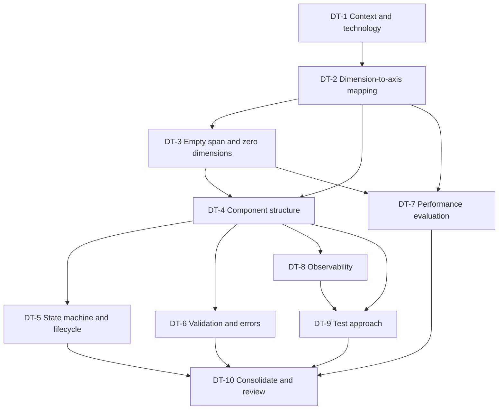

# Preliminary Design Execution Plan

| Document attribute | Value |
|---|---|
| Status | Historical Phase 1 plan; superseded by ECP-1 |
| Purpose | Define the work needed to produce a preliminary technical design for the Plan Line to Span demo |
| Scope | Plan Line to Span demo |
| Governing input | [Operational Concept](operational-concept.md) and the approved requirements baseline |
| Predecessor | [Requirements Readiness Completion Plan](requirements-readiness-completion-plan.md), completed |
| Successor | Detailed design and implementation |

> **ECP-1 note:** This plan records the Phase 1 design process and retains its original
> terminology as historical evidence. Current behavior and revised design decisions are
> governed by [ECP-1](ECP/ECP-1/ECP-1.md), its
> [implementation plan](ECP/ECP-1/ECP-1-implementation-plan.md), and the ECP-1-revised
> DT-1 through DT-10 records.

## 1. Objective

Requirements elicitation established *what* the utility does. Preliminary design establishes *how* it will be built, to the depth where an implementation team can begin detailed design and write code without inventing structural decisions.

The phase is complete when:

1. Every externally observable behavior in the baseline has an identified mechanism that produces it.
2. The two open technical risks — hierarchical-to-spatial mapping and empty-span representation — have demonstrated solutions rather than asserted ones.
3. A component structure exists with defined responsibilities and interfaces between components.
4. The acceptance cases can be mapped to the components that satisfy them.
5. No design decision that affects externally observable behavior is left to the implementer.

The last point mirrors the elicitation gate deliberately. That gate asked whether an implementer must invent *behavior*; this one asks whether they must invent *structure*.

## 2. Inherited constraints

These are fixed inputs. Design work does not reopen them; a design that cannot satisfy them is the wrong design.

| Constraint | Source | Design implication |
|---|---|---|
| Matching semantics: exact equality for `Query Benefit`, subset with hierarchical ancestry for `Query Employee` | OC 9.1, 9.2 | The index must produce exactly these result sets. |
| Span is the benefit's unique identity; at most one global benefit | OC 6.6 | Requires a canonical-form and duplicate-detection mechanism. |
| Empty span is valid and matches every plan line | OC 6.4 | See RISK-2. |
| Zero-dimensional model is valid | OC 7 | See RISK-2. |
| Reinitialization is atomic; no caller observes partial state | OC 8.2, 8.3 | Requires candidate-then-swap construction. |
| Failed operations change neither state nor index contents | OC 14.2, 14.3 | Requires mutation isolation until commit. |
| Operations are processed serially in accepted order | OC 10, 16.1.14 | Removes concurrency design, but must be enforced, not assumed. |
| Nine stable error codes with defined trigger conditions | IC 6 | Error paths are part of the design, not an afterthought. |
| Console JSON Lines with a fixed field set and privacy prohibitions | Observability Contract | Instrumentation points must be designed in, and must not carry payload data. |
| Index must not scan all benefits under normal operation | OC 15.2 | Rules out the naive linear-scan implementation as the delivered design. |
| The index is an R*-tree | Product-owner decision, section 2.1 | A fixed demonstration objective. The index is not a substitutable choice. |
| Node with TypeScript; backend service with in-memory state | DT-1, DEC-1 to DEC-3 | Serial processing holds by construction; logging targets process stdout. |

### 2.1 The R*-tree question

The baseline is ambiguous here and the design phase must resolve it explicitly rather than inherit the ambiguity.

Operational concept section 1 says the document "does not prescribe … the internal R*-tree implementation," which reads as design freedom. But section 3.1 places "creating the axes used by the R*-tree" in scope, section 6.7 defines the R*-tree as a core concept, and the archived context describes it as the point of the exercise.

**Confirmed by the product owner on 2026-07-31: the R\*-tree is a fixed demonstration objective.** It is not one candidate index among several. The demo exists to show dimension-aware matching working through a spatial index, so a design that satisfies the matching semantics by other means does not satisfy the demo's purpose.

This makes the R*-tree an inherited constraint on a par with those in section 2. DT-2 designs the mapping onto a spatial index; it does not evaluate whether to use one. Any departure would require reopening this decision with the product owner, not merely a recorded rationale.

## 3. Open technical risks

Two risks are carried forward. Both are structural: a wrong answer is expensive to undo later, so each has a design task that must produce a demonstrated result.

| ID | Risk | Why it matters | Retires in |
|---|---|---|---|
| RISK-1 | Hierarchical dimension values must map onto a spatial axis such that ancestor matching becomes a containment or range query. Nothing in the baseline specifies this mapping. | This is the core of the demo. If the mapping is wrong, `Query Employee` returns wrong results, or degenerates to a scan and violates OC 15.2. | **Retired** by [DT-2](design/dt-2-dimension-to-axis-mapping.md): nested-interval labelling makes ancestor-or-self exactly equivalent to interval containment, verified by 29 acceptance checks and 12,000 differential comparisons. |
| RISK-2 | An R*-tree implementation may require at least one dimension, but a zero-dimensional model and an empty global span are both valid. WP-3 confirmed feasibility but deliberately deferred the approach. | Affects the index's core data structure. Retrofitting is disruptive. | **Retired** by [DT-3](design/dt-3-empty-span-representation.md): the global benefit is an all-axis-covering box inside the index, and a zero-dimensional model is an index with zero axes whose split path is provably unreachable. |
| RISK-3 | No volume, latency, or memory targets exist. OC 15.2 requires index use rather than scanning, which is unmeasurable without a baseline. | Cannot demonstrate the efficiency claim, and cannot detect a design that is accidentally linear. | **Retired as a design matter** by [DT-7](design/dt-7-performance-evaluation.md): volumes, metric, and pass condition are defined and the method is validated against known-linear and known-sublinear implementations. The first measurement of a real index belongs to implementation. |
| RISK-4 | The JavaScript ecosystem's spatial indexes are predominantly two-dimensional. An n-dimensional R*-tree over an arbitrary dimension count is not a mature off-the-shelf component. Raised by DT-1. | The R*-tree is a fixed demonstration objective, so the index cannot be substituted. Either the index is implemented directly or a library is adapted, and that choice affects effort and the DT-2 schedule. | **Retired** by [DT-2a](design/dt-2a-index-library-evaluation.md): no library supports an arbitrary runtime dimension count, so the index will be implemented directly, generalizing `rbush` under MIT. |

RISK-1 and RISK-2 are prototype-backed: an argument on paper is not sufficient to retire them. RISK-4 is resolved by the same prototype work, since a working mapping prototype necessarily settles what the index is.

**Status: all four risks are retired**, each with executable evidence rather than argument, and the prototypes are committed under `docs/design/prototypes/` so the results can be reproduced by running `npm run prototypes`.

RISK-3's retirement carries one qualification worth restating at DT-10: the measurement *approach* is defined and validated, but no real index has been measured because none exists yet. The OC 15.2 efficiency claim is therefore designed-for rather than demonstrated, and it is the one design-phase item that cannot be fully closed before implementation.

## 4. Design tasks

Tasks are ordered by dependency. DT-2 and DT-3 are the critical path.

### DT-1: Confirm the architectural context and technology baseline

**Status: Complete, pending technical-lead approval.** Recorded in [DT-1: Architectural Context and Technology Baseline](design/dt-1-architectural-context.md).

Establish the runtime, language, and process model within which everything else is designed.

**Produces:** a short record of runtime and language choice with rationale; the process and deployment model for the demo; the boundary between the utility and its caller; and whether the utility is a library, a service, or both.

**Depends on:** nothing. **Retires:** no risk.

**Note:** the baseline is deliberately transport-neutral. This task chooses a concrete answer for the demo without making the interface contract transport-specific.

**Outcome:** Node with TypeScript; a backend service exposing the contract with a thin frontend added after the backend's acceptance cases pass; a single process with in-memory state. The record also carries the pattern and principle catalogue that constrains DT-4, and raises an index-library maturity risk that DT-2 must resolve as part of RISK-1.

### DT-2: Design the dimension-to-axis mapping

**Status: Complete, pending technical-lead approval.** Recorded in [DT-2: Dimension-to-Axis Mapping](design/dt-2-dimension-to-axis-mapping.md), with library selection in [DT-2a](design/dt-2a-index-library-evaluation.md).

The central design task. Define how a validated dimension model becomes the coordinate space the index operates in.

**Must specify:**

- How each dimension becomes one or more axes.
- How a hierarchical dimension's values map to coordinates such that an ancestor's range contains every descendant's range. Interval labelling of the hierarchy tree is the expected approach; alternatives are acceptable with rationale.
- How an omitted dimension in a span becomes a coordinate range covering that entire axis.
- How a plan-line value becomes the query geometry.
- How `Query Employee` becomes a containment query, and `Query Benefit` an exact-match lookup that hierarchy cannot broaden.
- Behavior when a hierarchy is a forest rather than a single rooted tree.

**Produces:** the mapping specification, a worked example using the section 12 scenario, and a prototype demonstrating correct results for the `AC-MATCH-*` cases.

**Depends on:** DT-1. **Retires:** RISK-1 and RISK-4.

**Library selection is settled.** [DT-2a](design/dt-2a-index-library-evaluation.md) evaluated the available spatial indexes against the instruction to adapt one only if reliable and safe. None supports an arbitrary runtime dimension count, and `rbush` — the only candidate meeting the reliability bar — silently returns false positives beyond two axes, which would violate OC 9.2. The index will be implemented directly, generalizing `rbush` under MIT with attribution.

**Exit criterion:** the prototype produces exactly the expected result sets for `AC-MATCH-01` through `AC-MATCH-11`, including the negative cases where a child span must not match a parent plan line. **Met:** 29 of 29 checks pass, and a differential test against a naive ancestor-walk oracle agrees on 12,000 of 12,000 comparisons across 300 random models including forests.

**Outcome:** nested-interval `[enter, leave]` labelling from a depth-first traversal, so that ancestor-or-self is exactly interval containment and no hierarchy walk occurs at query time. Non-hierarchical dimensions and forests use the same scheme without a special case. `Query Benefit` deliberately uses the canonical span key rather than the geometry, making OC 9.1's no-broadening guarantee structural.

### DT-3: Design the empty-span and zero-dimensional representation

**Status: Complete, pending technical-lead approval.** Recorded in [DT-3: Empty-Span and Zero-Dimensional Representation](design/dt-3-empty-span-representation.md).

Resolve what WP-3 deferred.

**Must specify:** how the global benefit is stored and retrieved; how a zero-dimensional model is represented; how `{}` works for exact query, update, and delete; and how the global benefit participates in employee-query results alongside indexed benefits.

**Produces:** the representation decision with rationale, and a prototype covering the `AC-GLOBAL-*` and `AC-ZERO-*` cases.

**Depends on:** DT-2. **Retires:** RISK-2.

**Constraint:** OC 15.1 requires that no externally observable behavior depend on whether the global benefit is stored inside or outside the index. If the design stores it outside, the design must show that result-set composition, ordering insignificance, and `benefitCount` remain indistinguishable from the alternative.

**Outcome:** the global benefit is stored inside the index as an all-axis-covering box, so the empty span needs no special case — it is the omitted-dimension wildcard rule applied to every axis at once. Both candidate representations were prototyped and shown observably identical, so the choice was made on structure: the in-index form removes five conditional branches and keeps `benefitCount`, duplicate detection, and atomic reinitialization uniform. DT-3 also imposes five requirements on the index implementation, listed in its section 5.1, which DT-2's main body must honor.

### DT-4: Design the component structure

**Status: Complete, pending technical-lead approval.** Recorded in [DT-4: Component Structure](design/dt-4-component-structure.md).

Decompose the utility into components with defined responsibilities.

**Must cover:** dimension-model loading and validation; canonical span construction and identity; the index and its adapter; the operation dispatcher enforcing serial processing and state gating; the validation pipeline and its mapping to the nine error codes; and the observability emitter.

**Produces:** a component diagram, a responsibility table, the interface each component exposes, and a dependency direction statement.

**Depends on:** DT-2, DT-3.

**Exit criterion:** every one of the nine error codes has exactly one component that owns producing it. **Met:** all nine assigned across seven owning components, verified mechanically, with the pipeline order confirmed against seventeen cases covering every code, the full IC 6.1 state matrix, and two precedence cases.

**Outcome:** eleven components as a hexagonal core with three adapters. `RequestParser` deliberately does not judge `formula` or `format`, so the IC 7 precedence rule that the WP-7 review caught as ISSUE-03 is now prevented structurally rather than by discipline. The state gate precedes all payload validation.

### DT-5: Design the state machine and operation lifecycle

**Status: Complete, pending technical-lead approval.** Recorded in [DT-5: State Machine and Operation Lifecycle](design/dt-5-lifecycle.md).

Turn the four-state lifecycle into a concrete mechanism.

**Must cover:** state representation and transition enforcement; how candidate-then-swap achieves atomic reinitialization; how a failed reinitialization discards the candidate and returns to Ready; how serial processing is enforced; and how a failed mutation is prevented from leaving partial changes.

**Produces:** the lifecycle design and the mutation-isolation mechanism.

**Depends on:** DT-4.

**Exit criterion:** the per-state acceptance table in Interface Contract 6.1 maps directly onto the designed gating logic, with `initialize` accepted from `Failed`. **Met:** all 24 state-operation cells agree with the contract table, plus the lifecycle paths, the rejected-request invariant, and state reachability.

**Outcome:** the gate is one expression derived from IC 6.1 rather than per-state cases, so the `failed`/`initialize` cell that ISSUE-04 concerned cannot regress. The prototype caught a real design error: applying the intake gate to operation *completions* strands the utility in `initializing` forever, because that state accepts nothing by design. Intake and completion are now distinct events.

### DT-6: Design validation and error handling

**Status: Complete, pending technical-lead approval.** Recorded in [DT-6: Validation and Error Handling](design/dt-6-validation-and-errors.md).

Design the path from a received message to a defined response.

**Must cover:** the ordered validation pipeline from structural through semantic to state checks; which layer owns each of the nine codes; and how `MALFORMED_REQUEST` is prevented from pre-empting `INVALID_FORMULA` and `INVALID_DIMENSION_DEFINITION`, per Interface Contract 7.

**Produces:** the pipeline design and a condition-to-code mapping table.

**Depends on:** DT-4.

**Exit criterion:** the twelve invalid messages from the readiness review resolve to their documented codes under the designed pipeline. **Met:** 18 of 18, comprising the twelve required messages plus six precedence and positive-path checks, each landing at its DT-4 owning component.

**Outcome:** structural validation compiles the project's own JSON Schema at runtime rather than duplicating it by hand, avoiding a second structural authority that could drift. IC 7 precedence is preserved because the schema deliberately does not constrain `formula` or `format`, so structural rejection of them is impossible rather than merely avoided.

### DT-7: Define the performance evaluation approach

**Status: Complete, pending technical-lead approval.** Recorded in [DT-7: Performance Evaluation Approach](design/dt-7-performance-evaluation.md).

Close the one item the baseline carried forward.

**Must specify:** demo evaluation volumes for dimensions, values, hierarchy depth, and benefit count; what is measured; and how the OC 15.2 claim that operations use the index rather than scanning is demonstrated — for example by showing that query time does not grow linearly with benefit count.

**Produces:** the evaluation approach, the volume definitions, and a measurement harness design.

**Depends on:** DT-2, DT-3. **Retires:** RISK-3.

**Note:** this establishes a demo baseline. It sets no production target, and OC 15.2 must not be rewritten to imply one.

**Outcome:** measure comparison counts rather than wall-clock time, and judge OC 15.2 by growth rate against benefit count, which is what the clause actually constrains. Four volumes stress dimensionality and hierarchy depth separately. The method was validated against a known-linear and a known-sublinear implementation and reaches the correct verdict for both, so it is capable of failing. **RISK-3 is retired as a design matter only:** no real index has been measured because none exists yet, so the OC 15.2 claim remains designed-for rather than demonstrated until implementation runs the harness.

### DT-8: Design the observability implementation

**Status: Complete, pending technical-lead approval.** Recorded in [DT-8: Observability Implementation](design/dt-8-observability.md).

**Must cover:** where instrumentation points sit relative to operation completion; how emission occurs only after an outcome is externally visible; how `sequence` and `durationMs` are produced; how log-emission failure is prevented from affecting the response; and the structural mechanism preventing spans, formulas, and dimension values from reaching a record.

**Produces:** the instrumentation design and the privacy-enforcement mechanism.

**Depends on:** DT-4.

**Exit criterion:** the privacy prohibition is enforced structurally, not by reviewer discipline. `AC-OBS-04` should be unable to fail by accident. **Met:** the closed-field builder exposes no unbounded string field, so payload data has nowhere to travel. Verified adversarially — every attempt to place a sentinel in a recognized field is rejected, and an extra `span` field is discarded rather than carried.

**Outcome:** one decorator around dispatch emits every record, so a new operation cannot be added without instrumentation. `level` is derived rather than supplied, so a failure cannot be logged at `info`. DT-6's open question is resolved: no record is emitted when the operation cannot be determined, since no operation completed — a small and deliberately recorded observability gap.

### DT-9: Design the test approach

**Status: Complete, pending technical-lead approval.** Recorded in [DT-9: Test Approach](design/dt-9-test-approach.md).

**Must cover:** how each of the 48 acceptance cases is executed; the fault-injection hook `AC-INIT-09` requires, or a recorded decision that `INDEX_FAILURE` stays unverified; how console output is captured and asserted; what unit-level coverage complements the acceptance cases; and the differential-testing harness required by DT-2a's DEC-13, which compares the R*-tree against a naive linear-scan matcher over generated models.

**Additional tests handed to DT-9 by later tasks:** that the handler path never awaits (DT-5 DEC-39); that the emitter is the only writer to standard output (DT-8); and shared fixture generation between the differential test and the DT-7 performance harness.

**Produces:** the test architecture, the fixture design including `D1`, and the case-to-test mapping.

**Depends on:** DT-4, DT-8.

**Note:** the readiness review flagged `AC-INIT-09` as not executable without fault injection. This task closes that gap or records its acceptance.

**Outcome:** all 48 cases mapped, 41 through the public contract surface and 7 requiring one of four test-only capabilities. The mapping is derived from the catalogue rather than transcribed, so a case added later without a test fails the check. **`AC-INIT-09` is now executable:** fault injection sits at `IndexAdapter` rather than inside `RTreeIndex`, closing the gap the readiness review recorded as unverifiable. Two obligations become static checks rather than runtime tests, since a static check is exhaustive where a test can only sample.

### DT-10: Consolidate and review

**Status: Complete, pending product-owner and technical-lead approval.** Recorded in [DT-10: Preliminary Design Consolidation and Review](design/dt-10-design-review.md).

Assemble the preliminary design document and run a review in the same form as WP-7.

**Produces:** the consolidated design; a traceability map from acceptance cases to components; an issue register; and a completed checklist.

**Depends on:** all preceding tasks.

**Outcome:** eleven of the twelve checklist items pass outright; item 6 is qualified because no index exists to measure yet. Four design issues are open, all bounded and accepted, with no severity-one issue. The review recommends progression to implementation, front-loading the index and mapping since they carry the retired-but-unexecuted risks.

## 5. Sequencing

DT-2 and DT-3 gate almost everything. They should start first and should not be compressed: they carry both prototype-backed risks, and a wrong answer in either propagates through every later task.

DT-5, DT-6, and DT-8 are independent of one another once DT-4 lands.

## 6. Deliverables

| Deliverable | Produced by |
|---|---|
| Preliminary design document | DT-10, consolidating all tasks |
| Dimension-to-axis mapping specification | DT-2 |
| Mapping prototype and results | DT-2, DT-3 |
| Component structure and interfaces | DT-4 |
| Condition-to-error-code mapping | DT-6 |
| Performance evaluation approach and volumes | DT-7 |
| Test architecture and case mapping | DT-9 |
| Design traceability map | DT-10 |
| Design issue register | DT-10 |

## 7. Review checklist

Applied at DT-10, in the form WP-7 used. Items marked *mechanical* must be demonstrated by execution rather than asserted by reading — that distinction is what made the WP-7 review catch real defects.

| # | Item | Kind |
|---|---|---|
| 1 | Every acceptance case maps to the components that satisfy it. | Mechanical |
| 2 | The mapping prototype produces correct results for all `AC-MATCH-*` cases. | Mechanical |
| 3 | The empty-span prototype covers all `AC-GLOBAL-*` and `AC-ZERO-*` cases. | Mechanical |
| 4 | Each of the nine error codes has exactly one owning component. | Mechanical |
| 5 | The twelve invalid messages resolve to their documented codes. | Mechanical |
| 6 | Query cost does not grow linearly with benefit count at the defined volumes. | Mechanical |
| 7 | No log record can structurally contain a span, formula, or dimension value. | Mechanical |
| 8 | Every inherited constraint in section 2 has an identified mechanism. | Reading |
| 9 | Every lifecycle transition and per-state acceptance rule is realized in the design. | Reading |
| 10 | No externally observable behavior is left to implementer choice. | Reading |
| 11 | Demo-only design decisions are not presented as production-ready. | Reading |
| 12 | Every design decision that departs from a baseline expectation is recorded with rationale. | Reading |

## 8. Exit criteria

1. All ten design tasks are complete or explicitly deferred with a recorded owner.
2. RISK-1 and RISK-2 are retired by working prototypes, not by argument.
3. No severity-one or severity-two design issue remains open.
4. The checklist in section 7 passes, with the mechanical items demonstrated by execution.
5. The product owner and technical lead approve progression to detailed design and implementation.

### 8.1 Assessment

Assessed by [DT-10](design/dt-10-design-review.md) on 2026-07-31.

| # | Criterion | Status |
|---|---|---|
| 1 | All ten design tasks complete or deferred with an owner | **Met.** Ten records; none deferred. |
| 2 | RISK-1 and RISK-2 retired by working prototypes | **Met.** Both closed with executable evidence, as were RISK-3 and RISK-4. |
| 3 | No severity-one or severity-two issue remains open | **Qualified.** No severity-one. ISSUE-D1 is severity two, accepted as a phase boundary: the efficiency claim cannot be measured before an index exists. |
| 4 | The section 7 checklist passes, mechanical items demonstrated | **Met for eleven of twelve.** Item 6 carries the ISSUE-D1 qualification. |
| 5 | Owners approve progression | **Outstanding.** An approval decision, not a review finding. |

Criteria 1, 2, and 4 are met. Criterion 3 turns on whether ISSUE-D1 blocks progression, which is an owner judgment: the alternative to accepting it is building the index during the design phase, which would make the phase boundary meaningless.

## 9. Responsibility model

| Responsibility | Suggested owner |
|---|---|
| Technology and runtime decisions | Technical lead |
| Dimension-to-axis mapping and index design | Technical lead |
| Empty-span and zero-dimensional representation | Technical lead |
| Component structure and interfaces | Technical lead with implementer review |
| Validation and error-path design | Technical lead |
| Performance evaluation approach | Technical lead with test owner |
| Test architecture | Test owner |
| Confirmation of the R*-tree interpretation in section 2.1 | Product owner |
| Design review and traceability | Requirements author or an independent reviewer |
| Final design approval | Product owner and technical lead |

## 10. Process observations

Three notes on the adequacy of the process itself, offered because this plan is being assessed for that.

**The mechanical-check habit should carry forward.** The elicitation phase's most valuable outcome was not the documents but the discovery that schema validation and trace extraction caught four contradictions that careful reading had missed. Section 7 preserves that by separating demonstrated items from read items. A design review that only reads will be weaker than WP-7 was.

**Prototypes are treated as design deliverables, not implementation.** DT-2 and DT-3 require working code before the design is considered sound. This is a deliberate departure from a document-only preliminary design, justified by RISK-1 and RISK-2 being the reason this demo is interesting. The risk of the alternative — a design document asserting that interval labelling will work — is that it is discovered to be wrong during implementation, when it is most expensive.

**Independence remains unaddressed.** The readiness review recorded that every baseline document was authored and reviewed within one authorship chain. That is still true, and the design phase will inherit it unless someone outside the chain reviews DT-10. This is the weakest point in the current process, and it is a staffing decision rather than a planning one.
